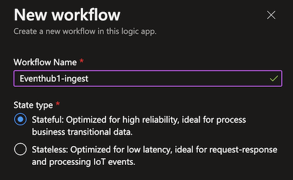
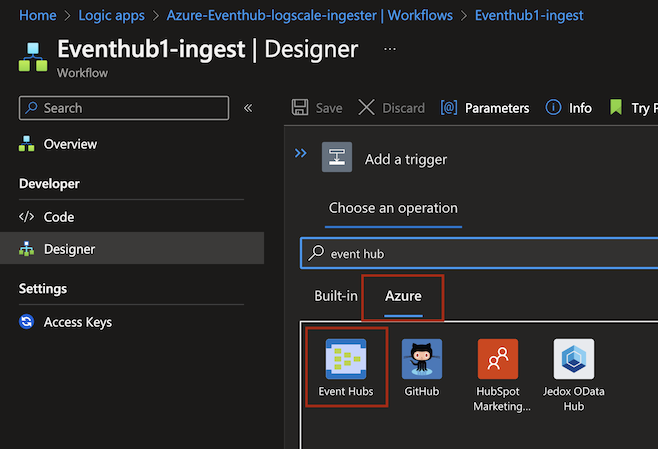
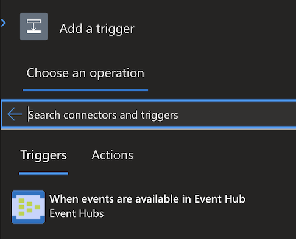
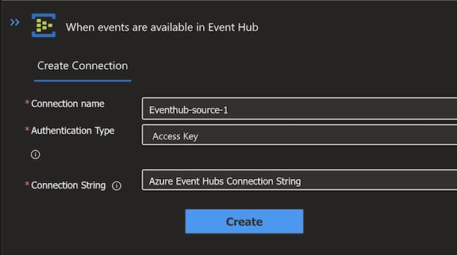
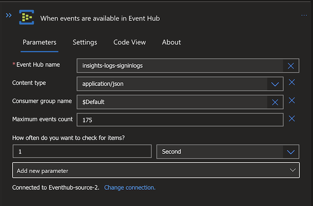
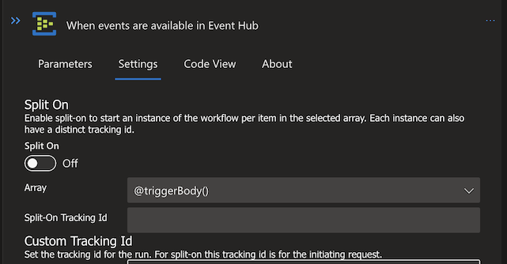
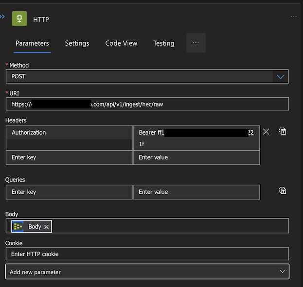

  
[](https://twitter.com/CrowdStrike)  

# CrowdStrike LogScale ingester for Event Hubs

Event Hubs are data/event ingesters which can be integrated with functions and services (Azure internal and external).  
As Event Hubs are often used as temporary storage of data/events, we can utilize Azure Logic Apps to forward the data/events to CrowdStrike LogScale for storage, analytics, or other purposes.  
## Set Up ##

### 1. Set up a LogScale repository, parser, and ingest token
Refer to Logscale Documentation for:

* [Instructions to set up a new LogScale repository](https://library.humio.com/humio-server/repositories-create.html#repositories-create)
* [Instructions to set up a custom parser](https://library.humio.com/humio-server/parsers-create.html)
* [Instructions to generate the ingest token](https://library.humio.com/humio-server/ingesting-data-tokens.html#ingesting-data-tokens-generate#ingesting-data-tokens-generate)


The following script can be copied and pasted for the custom parser:

```
parseJson(@rawstring)
| split("ContentData.records", strip=true) // Split into individual events
| drop([@rawstring, _index]) // Clean up
```

### 2. Create a Logic App within Azure
The Logic App will contain all of the workflows, each of which is used to forward data from a single Event Hub instance.
  

### 3. Create a Workflow for each Event Hub Instance
Each Event Hub instance to be ingested into LogScale requires a separate Workflow. To create a workflow, a Trigger and Action needs to be specified.  

 
For the Trigger, we are utilizing the "Event Hub" Trigger in the "Azure" tab.  

  
The trigger requires a connection with an Event Hub Namespace via the Connection String . The Connection String can be found after creating a Shared Access Policy within the Event Hub after adding an access policy in the "Shared access policies" tab with the "Listen" claim. The "Connection string–primary key" will be generated and can be used for the Workflow trigger.  
  
After the Event Hub Namespace is connected, the trigger can be set up with an Event Hub Instance from the dropdown list, with the Content Type "application/json", the default Consumer  group name, Maximum Event Count set to "175" and the interval to check for new events being "1 Second.  
  
In the settings tab of the Trigger, turn off "Split On" as shown in the screenshot below.  
  
For the Action, the simple "HTTP" action is needed with the Method being a "POST" request and the URI being the LogScale HEC URL (which should look similar to this: https://your-logscale-url.com/api/v1/ingest/hec/raw). The Header key and value, we follow the LogScale HEC format:  
```
Key: "Authorization"  
Value: "Bearer <Insert your Ingest Token created in Step 1>"
```
For the Body, "Body" needs to be selected to have the events in the correct format to be parsed into LogScale.  
  

Finally, the workflow can be saved, which will start the execution of the workflow and forward the data/events to LogScale.

## Notes 
---
* Batching of multiple events coming from Azure as a single log in LogScale as 175 events per second is the maximum allowed by Azure. 

## Future Additions
---
* Dashboard are currently not available, however will be published as a LogScale package on the Marketplace once available

<p align="center"><BR/></P>
<h3><P align="center">WE STOP BREACHES</P></h3>
